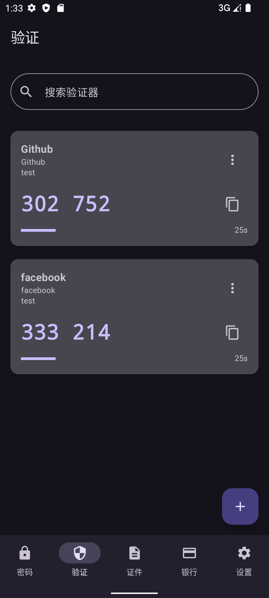

# Monica for Android 🔐

[中文](README_ZH.md) | **English**

<div align="center">


**Next-Generation Password Manager tailored for Android**
*Secure. Offline-First. Feature-Packed.*

</div>

---

## 📖 Overview

**Monica for Android** is not just a password manager; it's a comprehensive digital vault built with the latest Android technologies. It prioritizes **data sovereignty**—your data is encrypted locally using military-grade algorithms and never touches a cloud server unless *you* configure it to do so (via WebDAV).

With a stunning **Material You** interface, seamless **Autofill** integration, and advanced features like **KeePass support** and **TOTP generation**, Monica brings desktop-class power to your mobile device.

---

## ✨ Key Features

### 🔐 Advanced Credential Management
*   **Zero-Knowledge Encryption**: All data is encrypted using **AES-256-GCM** backed by Android Keystore. The master password never leaves your device.
*   **Rich Entries**: Store more than just passwords. Add **websites**, **notes**, **emails**, **phone numbers**, and custom tags.
*   **Password Generator**: Generate cryptographically identifying passwords with customizable rules (length, charset, entropy).
*   **History & Recycle Bin**: Accidentally deleted something? Recover it from the recycle bin. view previous password versions in history.

### �️ Next-Level TOTP Authenticator
*   **Integrated 2FA**: No need for a separate authenticator app.
*   **Smart Scan**: Add accounts instantly by scanning QR codes.
*   **Steam Guard**: Native support for Steam's proprietary 2FA protocol.
*   **Post-Fill Popup**: Automatically prompts the relevant TOTP code after autofilling a password—seamless login flow.

### � Sync & Backup (WebDAV)
*   **Your Cloud, Your Rules**: Sync securely across devices using any **WebDAV** provider (Nextcloud, Synology, JianguoYun, etc.).
*   **Encrypted Backups**: Backups are packed into ZIP files and can be optionally **double-encrypted** with AES-256-GCM, rendering them useless to anyone but you.
*   **Cross-Platform**: Fully compatible with Monica for Windows.

### 🧩 Interoperability & Migration
*   **KeePass Integration**: Directly **read and write** `.kdbx` files. Use Monica as a modern UI for your existing KeePass databases.
*   **Chrome Import**: Seamlessly migrate credentials from Google Chrome CSV exports.
*   **Data Export**: Full freedom to export your vault to CSV or encrypted JSON formats.

### 🤖 Intelligent Autofill System
*   **Refactored Engine**: Completely redesigned autofill service for higher compatibility with apps and browsers.
*   **Overlay Mode**: Non-intrusive overlay for quick access without leaving your current app.

### 📄 Secure Vault for Documents & Cards
*   **Bank Cards**: Encrypted storage for credit/debit cards with privacy masking.
*   **ID Documents**: Securely store digital copies of your passport, driver's license, and other IDs.
*   **Encrypted Notes**: A safe place for keys, recovery codes, and private memos.

---

## 🎨 Design & Experience

Monica embraces **Material Design 3** (Material You) to offer a visually stunning and responsive experience.

*   **Dynamic Theming**: UI colors adapt to your wallpaper (on Android 12+).
*   **Dark Mode**: Hand-crafted dark theme for OLED efficiency and eye comfort.
*   **Smooth Animations**: Fluid transitions powered by Jetpack Compose.
*   **Icon Support**: Visual icons for password cards for easier recognition.

---

## 🔒 Security Architecture

We take security seriously. Here is how your data is protected:

1.  **Encryption Key**: Your master password acts as the key to unlock the vault. It is hashed using **PBKDF2-HMAC-SHA256** with 100,000+ iterations.
2.  **Algorithm**: The database is encrypted using **AES-256** in **GCM (Galois/Counter Mode)**, preventing both reading and tampering (integrity attacks).
3.  **Hardware Security**: The encryption keys are wrapped by the **Android Keystore System** (TEE/SE), making them extraction-resistant even on rooted devices.
4.  **Privacy**:
    *   No Internet Permissions (except for WebDAV sync which you control).
    *   Screenshot blocking in secure views.
    *   Auto-lock on app switching or timeout.

---

## 🛠️ Tech Stack

Built by developers, for developers (and everyone else).

*   **Language**: [Kotlin](https://kotlinlang.org/)
*   **UI Framework**: [Jetpack Compose](https://developer.android.com/jetpack/compose)
*   **Architecture**: MVVM + Clean Architecture
*   **Database**: Room (SQLite) with SQLCipher support
*   **Async**: Coroutines & Flow
*   **Dependency Injection**: Manual DI (simple & efficient)
*   **Key Libraries**:
    *   `androidx.security:security-crypto`: EncryptedSharedPreferences & MasterKey
    *   `com.google.zxing`: QR Code processing
    *   `dom4j`: XML parsing for KeePass
    *   `sardine-android`: WebDAV client

---

## 📸 Screenshots

<div align="center">

| Vault Home | TOTP Authenticator | Settings |
|:---:|:---:|:---:|
|  |  |  |

</div>

---

## � Getting Started

### Installation
1.  Download the latest `.apk` from the [**Releases**](https://github.com/JoyinJoester/Monica/releases) page.
2.  Install on your Android device (Android 8 or higher required).
3.  Launch and follow the setup wizard to create your Master Password.

### Build from Source
```bash
# Clone the repository
git clone https://github.com/JoyinJoester/Monica.git
cd Monica

# Build the APK
./gradlew :app:assembleDebug
```

---

## 🤝 Support the Development

Monica is an open-source labor of love. If this app helps you secure your digital life, please consider supporting its development!

<div align="center">

<br/>
<sub>Scan using WeChat or Alipay</sub>
</div>

**Your support enables:**
*   Continuous security audits
*   New feature development (e.g., Passkey support)
*   Server costs for update distribution

---

## ⚖️ License

Copyright © 2025 JoyinJoester.
Licensed under the **GNU General Public License v3.0**.
