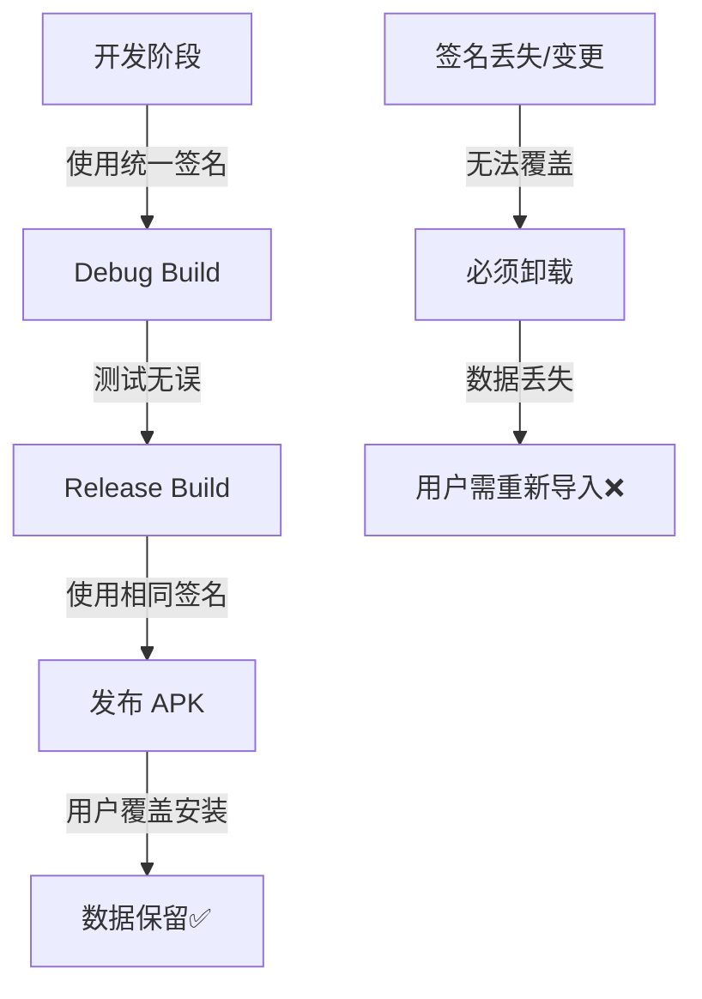

# 🔐 签名配置与数据丢失解决方案

## 问题确认

**根本原因**: APK 签名不一致导致无法覆盖安装,必须先卸载再安装,从而清空所有数据。

## Android 签名机制

### 签名的作用
1. **应用身份验证** - 确保 APK 来自可信来源
2. **覆盖安装保护** - 只有相同签名的 APK 才能覆盖安装
3. **数据隔离** - 不同签名的应用数据完全隔离

### 签名类型

| 类型 | 用途 | 特点 |
|------|------|------|
| **Debug 签名** | 开发调试 | Android Studio 自动生成,所有开发者共享相同证书 |
| **Release 签名** | 正式发布 | 开发者自己生成,必须妥善保管 |

### 数据丢失场景

```
情况 1: Debug → Debug (不同机器)
├─ 机器 A 的 debug.keystore
├─ 机器 B 的 debug.keystore
└─ ❌ 签名不同 → 无法覆盖 → 数据丢失

情况 2: Debug → Release
├─ Debug 签名 (默认)
├─ Release 签名 (自定义)
└─ ❌ 签名不同 → 无法覆盖 → 数据丢失

情况 3: Release → Release (签名丢失)
├─ 旧的 keystore
├─ 新的 keystore
└─ ❌ 签名不同 → 无法覆盖 → 数据丢失

✅ 正确情况: 使用相同的 keystore
├─ 同一个 keystore 文件
├─ 相同的密码和别名
└─ ✅ 签名相同 → 可以覆盖 → 数据保留
```

## 🛠️ 解决方案

### 方案 1: 统一使用 Debug 签名 (推荐用于开发)

**优点**:
- ✅ 简单,无需配置
- ✅ Android Studio 自动处理
- ✅ 适合个人开发和测试

**缺点**:
- ❌ 不同机器的 debug 签名不同
- ❌ 不能用于正式发布

**配置**:
```gradle
// 不需要额外配置,默认即可
buildTypes {
    debug {
        // 自动使用 ~/.android/debug.keystore
    }
}
```

**注意**:
- Debug keystore 位置: `C:\Users\<用户名>\.android\debug.keystore`
- 如果在多台机器开发,需要**共享同一个 debug.keystore**

---

### 方案 2: 创建统一的自定义签名 (推荐用于发布)

#### Step 1: 生成 Keystore

在项目根目录运行:

```powershell
# 创建 keystore 目录
New-Item -ItemType Directory -Force -Path "keystore"

# 生成 keystore (请修改密码和信息)
keytool -genkeypair `
    -v `
    -keystore keystore/monica-release.jks `
    -alias monica `
    -keyalg RSA `
    -keysize 2048 `
    -validity 10000 `
    -storepass your-store-password `
    -keypass your-key-password `
    -dname "CN=Monica, OU=Dev, O=Monica, L=City, S=State, C=CN"
```

**重要参数说明**:
- `-storepass`: keystore 密码 (请修改为强密码)
- `-keypass`: 密钥密码 (请修改为强密码)
- `-alias`: 别名,这里是 `monica`
- `-validity`: 有效期天数 (10000天 ≈ 27年)

#### Step 2: 创建签名配置文件

创建 `keystore.properties`:
```properties
storeFile=keystore/monica-release.jks
storePassword=your-store-password
keyAlias=monica
keyPassword=your-key-password
```

⚠️ **重要**: 将 `keystore.properties` 添加到 `.gitignore`,**不要提交到 Git**!

#### Step 3: 配置 build.gradle

```gradle
// 在 android {} 块之前加载签名配置
def keystorePropertiesFile = rootProject.file("keystore.properties")
def keystoreProperties = new Properties()
if (keystorePropertiesFile.exists()) {
    keystoreProperties.load(new FileInputStream(keystorePropertiesFile))
}

android {
    // ... 其他配置 ...
    
    signingConfigs {
        release {
            if (keystorePropertiesFile.exists()) {
                storeFile file(keystoreProperties['storeFile'])
                storePassword keystoreProperties['storePassword']
                keyAlias keystoreProperties['keyAlias']
                keyPassword keystoreProperties['keyPassword']
            }
        }
        debug {
            if (keystorePropertiesFile.exists()) {
                // Debug 也使用相同签名,确保一致性
                storeFile file(keystoreProperties['storeFile'])
                storePassword keystoreProperties['storePassword']
                keyAlias keystoreProperties['keyAlias']
                keyPassword keystoreProperties['keyPassword']
            }
        }
    }
    
    buildTypes {
        release {
            signingConfig signingConfigs.release
            minifyEnabled true
            shrinkResources true
            proguardFiles getDefaultProguardFile('proguard-android.txt'), 'proguard-rules.pro'
        }
        debug {
            signingConfig signingConfigs.debug
            minifyEnabled false
            shrinkResources false
        }
    }
}
```

#### Step 4: 更新 .gitignore

```gitignore
# 签名文件 - 绝对不要提交!
keystore/
*.jks
*.keystore
keystore.properties
```

---

### 方案 3: 使用统一的 Debug Keystore (最简单)

如果您只是个人使用或团队开发,最简单的方法是**共享同一个 debug keystore**:

1. **找到您的 debug keystore**:
   ```
   C:\Users\joyins\.android\debug.keystore
   ```

2. **备份它**:
   ```powershell
   Copy-Item "C:\Users\joyins\.android\debug.keystore" `
             "C:\Users\joyins\Desktop\Monica-main\Monica for Android\keystore\debug.keystore"
   ```

3. **配置使用固定的 debug keystore**:
   ```gradle
   android {
       signingConfigs {
           debug {
               storeFile file('keystore/debug.keystore')
               storePassword 'android'
               keyAlias 'androiddebugkey'
               keyPassword 'android'
           }
       }
   }
   ```

4. **在所有开发机器上使用相同的 debug.keystore**

---

## 🚀 推荐操作流程

### 对于您当前的情况:

1. **立即检查设备上的旧版本签名**:
   ```powershell
   # 获取已安装应用的签名
   adb shell pm list packages -f takagi.ru.monica
   adb pull /data/app/<package-path>/base.apk old-monica.apk
   
   # 查看签名
   keytool -printcert -jarfile old-monica.apk
   ```

2. **提取旧版本的签名信息**,尝试匹配或重新签名

3. **如果无法恢复旧签名**:
   - 创建新的统一签名
   - 增加版本号
   - 用户需要先备份数据,卸载旧版,安装新版

### 未来发布流程:



## 📋 检查清单

在发布新版本前,确保:

- [ ] 使用与上一版本**完全相同**的 keystore
- [ ] 检查 `storePassword` 和 `keyPassword` 正确
- [ ] 检查 `keyAlias` 正确
- [ ] **备份 keystore 文件** (多个位置)
- [ ] **记录密码** (安全存储)
- [ ] 在测试设备上验证覆盖安装成功
- [ ] 验证数据未丢失

## ⚠️ 关键注意事项

1. **Keystore 丢失 = 永远无法更新**
   - 如果丢失 keystore,用户必须卸载重装
   - Google Play 无法接受新签名的更新

2. **密码忘记 = Keystore 失效**
   - 无法恢复密码
   - 等同于 keystore 丢失

3. **签名配置文件不要提交到 Git**
   - keystore 泄露 = 任何人都能发布冒名的 APK
   - 使用 `.gitignore` 保护

4. **多重备份**
   - 云存储 (加密)
   - U盘
   - 密码管理器

## 🔍 诊断工具

### 检查 APK 签名:
```powershell
# 查看 APK 签名信息
keytool -printcert -jarfile app-debug.apk

# 比较两个 APK 的签名
jarsigner -verify -verbose -certs app1.apk
jarsigner -verify -verbose -certs app2.apk
```

### 检查设备上已安装应用的签名:
```powershell
# 获取应用路径
adb shell pm path takagi.ru.monica

# 导出 APK
adb pull <path> installed.apk

# 查看签名
keytool -printcert -jarfile installed.apk
```

---

**需要帮助设置签名配置吗?** 告诉我您选择哪个方案,我可以帮您配置!
