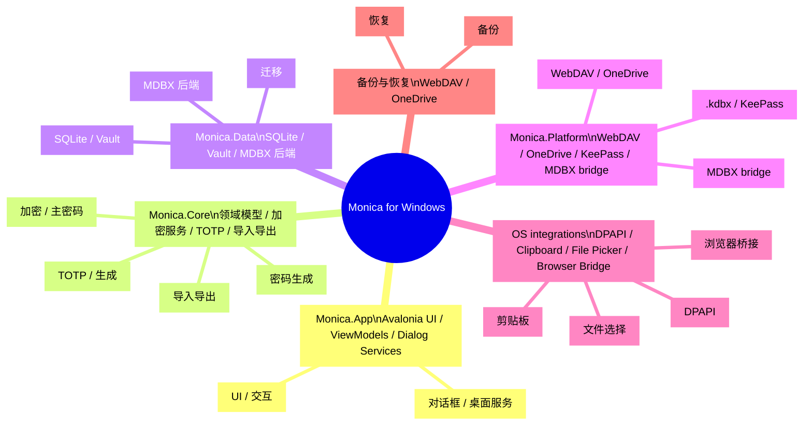

# Monica for Windows

> Monica by Avalonia：用 Avalonia、.NET 与 MDBX 打造本地优先的跨平台密码库。  
> Windows / macOS / Linux · Local Vault · MDBX-1 · KeePass · TOTP · WebDAV / OneDrive

::: navCard
```yaml
- name: Monica by Avalonia
  desc: Avalonia + .NET + MDBX 本地密码库
  link: https://github.com/Monica-Pass/Monica-by-Avalonia
  img: https://github.githubassets.com/images/modules/logos_page/GitHub-Mark.png
  badge: 仓库
  badgeType: tip

- name: wwiinnddyy
  desc: 项目贡献作者
  link: https://github.com/wwiinnddyy
  img: https://avatars.githubusercontent.com/u/53892426
  badge: 作者
  badgeType: info

- name: JoyinJoester
  desc: 项目贡献作者
  link: https://github.com/JoyinJoester
  img: https://avatars.githubusercontent.com/u/87232423
  badge: 作者
  badgeType: info
```
:::

::: note 摘要
Monica for Windows 是 Monica 密码库的桌面端实现，聚焦本地优先、密码管理与 MDBX vault 兼容。本文按项目 README 风格撰写，提供功能介绍、技术栈、架构视图与开发说明。
:::

Monica for Windows 目标是在桌面平台上延续 Monica 的本地优先与安全优先路线，提供密码、TOTP、私密笔记、银行卡与证件管理，并支持本地加密、导入导出、备份与 MDBX vault 兼容。

---

## 项目定位

Monica for Windows 是面向桌面用户的本地优先密码库客户端。它以跨平台的 Avalonia 桌面 UI 为基础，结合 .NET 10 与 MDBX 本地 vault，构建一个既现代又可扩展的桌面密码管理体验。

本项目核心目标：

- 提供本地加密密码库与 TOTP 管理能力
- 支持 KeePass `.kdbx` 与 Monica / MDBX 数据兼容
- 支持 WebDAV 和 OneDrive 的备份与恢复
- 提供桌面平台的文件选择、剪贴板、托盘、全局快捷键等集成能力

---

## 你能得到什么

- 本地密码库：账号、密码、网址、自定义字段、附件与分类管理
- TOTP 管理：保存并生成动态验证码
- 私密笔记：支持纯文本与 Markdown 预览
- 卡片与证件：统一管理银行卡、身份信息与其他敏感资料
- 密码生成：内置随机密码生成与强度分析
- 本地加密：主密码初始化、解锁、变更与安全恢复设置
- 导入导出：支持 Monica JSON、密码 CSV、TOTP CSV、Aegis JSON 等格式
- 同步与备份：WebDAV / OneDrive 备份与恢复能力
- MDBX vault：创建、检查与管理 Monica MDBX-1 本地数据库

---

## 技术栈

| 层级 | 技术 | 说明 |
| --- | --- | --- |
| 桌面 UI | Avalonia 12, FluentAvaloniaUI, FluentIcons.Avalonia | 跨平台桌面界面与 Fluent 风格控件 |
| 应用框架 | .NET 10, C# nullable, compiled bindings | 现代 .NET 桌面运行时与类型安全绑定 |
| MVVM | CommunityToolkit.Mvvm | ViewModel、命令、属性通知 |
| 依赖注入与日志 | Microsoft.Extensions.DependencyInjection, Microsoft.Extensions.Logging, Serilog | 服务注册与日志抽象 |
| 本地数据 | Microsoft.Data.Sqlite, SQLitePCLRaw, Dapper, Dapper.AOT | 轻量数据访问、迁移与 AOT 友好查询 |
| 加密与安全 | BouncyCastle, Argon2, ProtectedData, AES/SHA 相关实现 | 主密码派生与本地数据保护 |
| 密码能力 | PasswordGenerator, zxcvbn-core, Pwned Password 检查 | 密码生成、强度评估与风险检测 |
| TOTP / QR | Otp.NET, QRCoder, ZXing.Net | 动态验证码与二维码生成/解析 |
| 导入导出 | CsvHelper, SharpCompress, System.Text.Json | CSV、JSON、压缩备份与迁移 |
| KeePass 生态 | KPCLib | `.kdbx` 文件兼容能力 |
| 云端与同步 | WebDav.Client, Microsoft.Graph, Azure.Identity, MSAL, Polly | WebDAV、OneDrive、认证与重试策略 |
| MDBX 接入 | Rust MDBX workspace, UniFFI, `mdbx_ffi.dll` | 复用 Monica MDBX vault 核心能力 |
| 测试 | xUnit, Microsoft.NET.Test.Sdk, coverlet | 核心服务与平台服务测试 |

---

## 架构概览

::: tip 架构预览
Monica for Windows 的架构是一颗“桌面密码库思维树”，核心在于：
- UI 层负责交互与展示
- Core 层负责业务与加密逻辑
- Data 层负责 Vault 存储与持久化
- Platform 层负责同步、平台集成与 MDBX 适配
:::

::: details 架构说明
- `Monica.App`：Avalonia 界面、窗口与桌面服务
- `Monica.Core`：业务模型、加密、TOTP、导入导出、密码生成
- `Monica.Data`：本地数据库、Vault 存储、迁移与 MDBX 后端仓储
- `Monica.Platform`：跨平台适配层，包含 WebDAV、OneDrive、KeePass、MDBX bridge
- `MDBX Rust workspace`：Vault 核心、加密、存储、FFI 与 CLI 支持
- `OS integrations`：文件选择、剪贴板、DPAPI、浏览器桥接
- `Remote backup`：WebDAV/OneDrive 备份与恢复通道
:::

::: warning
架构设计中，<mark>MDBX 不是普通数据库表</mark>，必须通过专用 API 或 FFI facade 管理 commit、snapshot 和 conflict 元数据。
:::



### 代码目录

- `monica by avalonia/src/Monica.App`：Avalonia 应用入口、主窗口、ViewModel 与桌面 UI 服务
- `monica by avalonia/src/Monica.Core`：核心模型、加密、TOTP、密码生成、导入导出、安全能力
- `monica by avalonia/src/Monica.Data`：SQLite 数据库、Dapper 仓储、迁移、Vault 存储、MDBX 后端仓储
- `monica by avalonia/src/Monica.Platform`：平台适配、WebDAV、OneDrive、KeePass、Windows Secret Protector、MDBX UniFFI 本地桥接
- `monica by avalonia/tests/Monica.Tests`：核心服务、仓储、MDBX 接入与平台服务测试

---

## MDBX-1 接入

Monica for Windows 支持 MDBX-1 本地优先 vault，它不是普通的 SQLite 密码表，而是一个带有版本历史、冲突处理、快照恢复与安全边界的本地数据库格式。

Avalonia 端当前包含两条 MDBX 接入路径：

- `MdbxUniffiNativeBridge`：通过 `mdbx_ffi.dll` 调用 UniFFI bridge，直接在本地进程中操作 MDBX vault。
- `MdbxCliVaultEngine`：当 native bridge 不可用时，回退到 MDBX CLI，用于开发与验证。

> MDBX 客户端必须通过库提供的 storage / repo API 或明确的 FFI facade 维护 commit、tombstone、snapshot、conflict、device head 等元数据，避免直接修改底层文件。

更多规范请参考 MDBX 仓库文档。

---

## 快速开始

### 环境要求

- .NET SDK 10.0+
- Windows 桌面环境
- 若启用 MDBX CLI 回退能力，需安装 Rust toolchain

### 还原与构建

```powershell
cd "e:\projects\MonicaDocs\docs\03.生态\03.Windows\monica by avalonia"
dotnet restore Monica.slnx
dotnet build Monica.slnx
```

### 运行桌面端

```powershell
dotnet run --project "src\Monica.App\Monica.App.csproj"
```

### 运行测试

```powershell
dotnet test Monica.slnx
```

### 发布示例

```powershell
dotnet publish "src\Monica.App\Monica.App.csproj" -c Release -r win-x64 --self-contained true
```

---

## 当前状态

- 项目处于早期开发阶段（0.1.0），主要作为桌面端架构与 MDBX 接入基线。
- 已覆盖 App 设置、核心服务、密码管理、TOTP、MDBX 存储与平台服务的测试基础。
- 真实敏感数据建议保持多份备份，正式发布前仍需补充更多截图与发布说明。

---

## 与 Monica / MDBX 的关系

- Monica：提供产品理念、本地优先路线与密码管理体验参考
- MDBX：提供本地优先 vault 格式与长期可维护的数据结构
- Monica for Windows：作为桌面端实现，将两者能力融合到 Windows 桌面应用中

---

## 致谢

Monica for Windows 参考并借鉴了以下项目：

- [Avalonia](https://avaloniaui.net/)：跨平台桌面 UI
- [FluentAvalonia](https://github.com/amwx/FluentAvalonia)：Fluent 风格控件
- [Bitwarden](https://bitwarden.com/)：密码管理生态参考
- [KeePass](https://keepass.info/)：本地密码库与 `.kdbx` 兼容参考
- [MDBX](https://github.com/Monica-Pass/Mdbx)：本地优先 vault 格式参考

---

## 许可证

本项目基于 [GNU General Public License v3.0](LICENSE) 开源发布。
