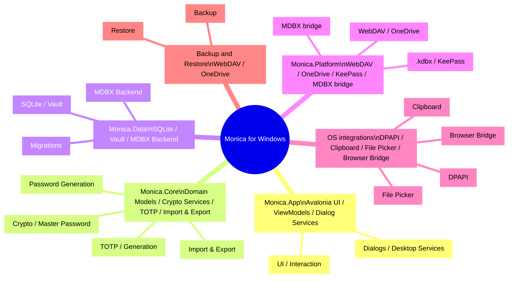

# Monica for Windows

> Monica by Avalonia: a local-first cross-platform password vault built with Avalonia, .NET, and MDBX.  
> Windows / macOS / Linux · Local Vault · MDBX-1 · KeePass · TOTP · WebDAV / OneDrive

::: navCard
```yaml
- name: Monica by Avalonia
  desc: Avalonia + .NET + MDBX local password vault
  link: https://github.com/Monica-Pass/Monica-by-Avalonia
  img: https://github.githubassets.com/images/modules/logos_page/GitHub-Mark.png
  badge: Repository
  badgeType: tip

- name: wwiinnddyy
  desc: Project contributor
  link: https://github.com/wwiinnddyy
  img: https://avatars.githubusercontent.com/u/53892426
  badge: Author
  badgeType: info

- name: JoyinJoester
  desc: Project contributor
  link: https://github.com/JoyinJoester
  img: https://avatars.githubusercontent.com/u/87232423
  badge: Author
  badgeType: info
```
:::

::: note Abstract
Monica for Windows is the desktop implementation of the Monica password vault, focused on local-first password management and MDBX vault compatibility. This document follows a README-style structure and provides a feature overview, tech stack, architecture view, and development notes.
:::

Monica for Windows aims to carry Monica’s local-first and security-first direction onto desktop platforms, offering management for passwords, TOTP, private notes, bank cards, and identity documents, along with local encryption, import/export, backup, and MDBX vault compatibility.

---

## Project Positioning

Monica for Windows is a local-first password vault client for desktop users. Built on Avalonia’s cross-platform desktop UI together with .NET 10 and the MDBX local vault, it is designed to deliver a desktop password management experience that is both modern and extensible.

Core goals of the project:

- Provide local encrypted vault and TOTP management capabilities
- Support compatibility with KeePass `.kdbx` and Monica / MDBX data
- Support backup and restore through WebDAV and OneDrive
- Provide desktop integrations such as file pickers, clipboard access, system tray support, and global shortcuts

---

## What You Get

- Local password vault: manage accounts, passwords, URLs, custom fields, attachments, and categories
- TOTP management: store and generate dynamic verification codes
- Private notes: support plain text and Markdown preview
- Cards and identity documents: manage bank cards, identity data, and other sensitive information in one place
- Password generation: built-in random password generation and strength analysis
- Local encryption: master password initialization, unlock, change, and secure recovery settings
- Import and export: support Monica JSON, password CSV, TOTP CSV, Aegis JSON, and more
- Sync and backup: WebDAV / OneDrive backup and restore
- MDBX vault: create, inspect, and manage Monica MDBX-1 local databases

---

## Tech Stack

| Layer | Technology | Notes |
| --- | --- | --- |
| Desktop UI | Avalonia 12, FluentAvaloniaUI, FluentIcons.Avalonia | Cross-platform desktop UI and Fluent-style controls |
| Application framework | .NET 10, C# nullable, compiled bindings | Modern .NET desktop runtime and type-safe bindings |
| MVVM | CommunityToolkit.Mvvm | ViewModels, commands, and property notifications |
| Dependency injection and logging | Microsoft.Extensions.DependencyInjection, Microsoft.Extensions.Logging, Serilog | Service registration and logging abstractions |
| Local data | Microsoft.Data.Sqlite, SQLitePCLRaw, Dapper, Dapper.AOT | Lightweight data access, migrations, and AOT-friendly queries |
| Cryptography and security | BouncyCastle, Argon2, ProtectedData, AES/SHA-related implementations | Master password derivation and local data protection |
| Password capabilities | PasswordGenerator, zxcvbn-core, Pwned Password checks | Password generation, strength evaluation, and risk detection |
| TOTP / QR | Otp.NET, QRCoder, ZXing.Net | Dynamic codes and QR-code generation/parsing |
| Import/export | CsvHelper, SharpCompress, System.Text.Json | CSV, JSON, compressed backup, and migration |
| KeePass ecosystem | KPCLib | `.kdbx` compatibility |
| Cloud and sync | WebDav.Client, Microsoft.Graph, Azure.Identity, MSAL, Polly | WebDAV, OneDrive, authentication, and retry policies |
| MDBX integration | Rust MDBX workspace, UniFFI, `mdbx_ffi.dll` | Reuses Monica MDBX vault core capabilities |
| Testing | xUnit, Microsoft.NET.Test.Sdk, coverlet | Tests for core services and platform services |

---

## Architecture Overview

::: tip Architecture Preview
The architecture of Monica for Windows can be understood as a “desktop password vault thought tree,” centered on:

- The UI layer for interaction and presentation
- The Core layer for business logic and cryptography
- The Data layer for vault storage and persistence
- The Platform layer for sync, platform integration, and MDBX adaptation
:::

::: details Architecture Notes
- `Monica.App`: Avalonia UI, windows, and desktop services
- `Monica.Core`: domain models, cryptography, TOTP, import/export, password generation
- `Monica.Data`: local database, vault storage, migrations, and MDBX backend repositories
- `Monica.Platform`: cross-platform adaptation layer including WebDAV, OneDrive, KeePass, and the MDBX bridge
- `MDBX Rust workspace`: vault core, cryptography, storage, FFI, and CLI support
- `OS integrations`: file pickers, clipboard, DPAPI, browser bridge
- `Remote backup`: WebDAV/OneDrive backup and restore channels
:::

::: warning
In this architecture, <mark>MDBX is not an ordinary database table</mark>. Commit, snapshot, and conflict metadata must be managed through dedicated APIs or an FFI facade.
:::



### Code Directories

- `monica by avalonia/src/Monica.App`: Avalonia app entry point, main window, ViewModels, and desktop UI services
- `monica by avalonia/src/Monica.Core`: core models, cryptography, TOTP, password generation, import/export, and security capabilities
- `monica by avalonia/src/Monica.Data`: SQLite database, Dapper repositories, migrations, vault storage, and MDBX backend repositories
- `monica by avalonia/src/Monica.Platform`: platform adapters, WebDAV, OneDrive, KeePass, Windows Secret Protector, and MDBX UniFFI native bridge
- `monica by avalonia/tests/Monica.Tests`: tests for core services, repositories, MDBX integration, and platform services

---

## MDBX-1 Integration

Monica for Windows supports the MDBX-1 local-first vault. It is not an ordinary SQLite password table, but a local database format with version history, conflict handling, snapshot recovery, and security boundaries.

The Avalonia side currently includes two MDBX integration paths:

- `MdbxUniffiNativeBridge`: calls the UniFFI bridge through `mdbx_ffi.dll` to operate the MDBX vault directly inside the local process
- `MdbxCliVaultEngine`: falls back to the MDBX CLI when the native bridge is unavailable, mainly for development and validation

> MDBX clients must maintain commit, tombstone, snapshot, conflict, and device-head metadata through the storage / repo APIs provided by the library or through an explicit FFI facade. Do not modify the underlying files directly.

For more details, refer to the MDBX repository documentation.

---

## Quick Start

### Requirements

- .NET SDK 10.0+
- Windows desktop environment
- Rust toolchain if you want MDBX CLI fallback support

### Restore and Build

```powershell
cd "e:\projects\MonicaDocs\docs\03.生态\03.Windows\monica by avalonia"
dotnet restore Monica.slnx
dotnet build Monica.slnx
```

### Run the Desktop App

```powershell
dotnet run --project "src\Monica.App\Monica.App.csproj"
```

### Run Tests

```powershell
dotnet test Monica.slnx
```

### Publish Example

```powershell
dotnet publish "src\Monica.App\Monica.App.csproj" -c Release -r win-x64 --self-contained true
```

---

## Current Status

- The project is in an early development stage (`0.1.0`) and mainly serves as the desktop architecture and MDBX integration baseline.
- Test foundations already cover app settings, core services, password management, TOTP, MDBX storage, and platform services.
- For real sensitive data, multiple backups are still strongly recommended. More screenshots and release notes are still needed before a formal release.

---

## Relationship to Monica / MDBX

- Monica: provides the product vision, local-first direction, and password management UX reference
- MDBX: provides the local-first vault format and long-term maintainable data structures
- Monica for Windows: merges both into a desktop implementation for Windows

---

## Acknowledgements

Monica for Windows references and draws inspiration from the following projects:

- [Avalonia](https://avaloniaui.net/): cross-platform desktop UI
- [FluentAvalonia](https://github.com/amwx/FluentAvalonia): Fluent-style controls
- [Bitwarden](https://bitwarden.com/): password management ecosystem reference
- [KeePass](https://keepass.info/): local vault and `.kdbx` compatibility reference
- [MDBX](https://github.com/Monica-Pass/Mdbx): local-first vault format reference

---

## License

This project is open-sourced under the [GNU General Public License v3.0](LICENSE).
