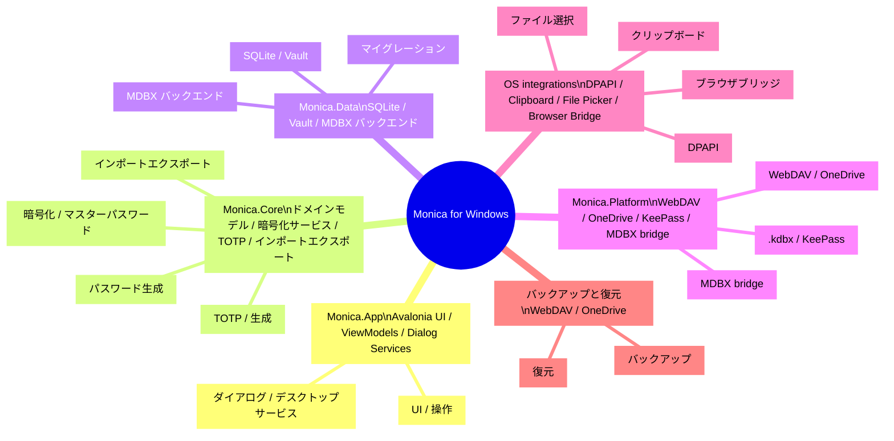

# Monica for Windows

> Monica by Avalonia: Avalonia、.NET、MDBX で構築するローカルファーストのクロスプラットフォームパスワード保管庫。  
> Windows / macOS / Linux · Local Vault · MDBX-1 · KeePass · TOTP · WebDAV / OneDrive

::: navCard
```yaml
- name: Monica by Avalonia
  desc: Avalonia + .NET + MDBX ローカルパスワード保管庫
  link: https://github.com/Monica-Pass/Monica-by-Avalonia
  img: https://github.githubassets.com/images/modules/logos_page/GitHub-Mark.png
  badge: リポジトリ
  badgeType: tip

- name: wwiinnddyy
  desc: プロジェクト貢献者
  link: https://github.com/wwiinnddyy
  img: https://avatars.githubusercontent.com/u/53892426
  badge: 作者
  badgeType: info

- name: JoyinJoester
  desc: プロジェクト貢献者
  link: https://github.com/JoyinJoester
  img: https://avatars.githubusercontent.com/u/87232423
  badge: 作者
  badgeType: info
```
:::

::: note 概要
Monica for Windows は Monica パスワード保管庫のデスクトップ実装であり、ローカルファースト、パスワード管理、MDBX vault 互換に重点を置いています。このページは README スタイルで、機能紹介、技術スタック、アーキテクチャの見取り図、開発情報をまとめています。
:::

Monica for Windows は、Monica のローカルファーストかつセキュリティ優先の方針をデスクトップ環境でも継承し、パスワード、TOTP、セキュアノート、銀行カード、証明書情報の管理に加えて、ローカル暗号化、インポート/エクスポート、バックアップ、MDBX vault 互換を提供することを目指しています。

---

## プロジェクトの位置づけ

Monica for Windows は、デスクトップユーザー向けのローカルファーストパスワード保管庫クライアントです。クロスプラットフォームの Avalonia デスクトップ UI を基盤とし、.NET 10 と MDBX ローカル vault を組み合わせることで、モダンで拡張性の高いデスクトップ向けパスワード管理体験を構築します。

このプロジェクトの主な目標:

- ローカル暗号化パスワード保管庫と TOTP 管理機能を提供する
- KeePass `.kdbx` および Monica / MDBX データとの互換性を確保する
- WebDAV と OneDrive によるバックアップと復元をサポートする
- デスクトップ環境向けに、ファイル選択、クリップボード、トレイ、グローバルショートカットなどの統合機能を提供する

---

## このプロジェクトでできること

- ローカルパスワード保管庫: アカウント、パスワード、URL、カスタムフィールド、添付ファイル、分類の管理
- TOTP 管理: 動的認証コードの保存と生成
- セキュアノート: プレーンテキストと Markdown プレビューに対応
- カードと証明書: 銀行カード、本人確認情報、その他の機密情報を一元管理
- パスワード生成: ランダムパスワード生成と強度分析を内蔵
- ローカル暗号化: マスターパスワード初期化、ロック解除、変更、安全な復旧設定
- インポート/エクスポート: Monica JSON、パスワード CSV、TOTP CSV、Aegis JSON などの形式に対応
- 同期とバックアップ: WebDAV / OneDrive によるバックアップと復元
- MDBX vault: Monica MDBX-1 ローカルデータベースの作成、検査、管理

---

## 技術スタック

| 層 | 技術 | 説明 |
| --- | --- | --- |
| デスクトップ UI | Avalonia 12, FluentAvaloniaUI, FluentIcons.Avalonia | クロスプラットフォームのデスクトップ UI と Fluent スタイルのコントロール |
| アプリケーション基盤 | .NET 10, C# nullable, compiled bindings | モダンな .NET デスクトップランタイムと型安全なバインディング |
| MVVM | CommunityToolkit.Mvvm | ViewModel、コマンド、プロパティ変更通知 |
| 依存性注入とログ | Microsoft.Extensions.DependencyInjection, Microsoft.Extensions.Logging, Serilog | サービス登録とログ抽象化 |
| ローカルデータ | Microsoft.Data.Sqlite, SQLitePCLRaw, Dapper, Dapper.AOT | 軽量なデータアクセス、マイグレーション、AOT 対応クエリ |
| 暗号化とセキュリティ | BouncyCastle, Argon2, ProtectedData, AES/SHA 関連実装 | マスターパスワード導出とローカルデータ保護 |
| パスワード機能 | PasswordGenerator, zxcvbn-core, Pwned Password チェック | パスワード生成、強度評価、リスク検出 |
| TOTP / QR | Otp.NET, QRCoder, ZXing.Net | 動的認証コードと QR コードの生成/解析 |
| インポート/エクスポート | CsvHelper, SharpCompress, System.Text.Json | CSV、JSON、圧縮バックアップ、移行 |
| KeePass エコシステム | KPCLib | `.kdbx` ファイル互換機能 |
| クラウドと同期 | WebDav.Client, Microsoft.Graph, Azure.Identity, MSAL, Polly | WebDAV、OneDrive、認証、リトライ戦略 |
| MDBX 統合 | Rust MDBX workspace, UniFFI, `mdbx_ffi.dll` | Monica MDBX vault の中核機能を再利用 |
| テスト | xUnit, Microsoft.NET.Test.Sdk, coverlet | コアサービスとプラットフォームサービスのテスト |

---

## アーキテクチャ概要

::: tip アーキテクチャ概要
Monica for Windows のアーキテクチャは、「デスクトップパスワード保管庫の思考ツリー」として整理できます。中核となる考え方は次の通りです。

- UI 層が操作と表示を担当
- Core 層が業務ロジックと暗号化ロジックを担当
- Data 層が Vault の保存と永続化を担当
- Platform 層が同期、プラットフォーム統合、MDBX 適応を担当
:::

::: details アーキテクチャ説明
- `Monica.App`: Avalonia UI、ウィンドウ、デスクトップサービス
- `Monica.Core`: ドメインモデル、暗号化、TOTP、インポート/エクスポート、パスワード生成
- `Monica.Data`: ローカルデータベース、Vault ストレージ、マイグレーション、MDBX バックエンドリポジトリ
- `Monica.Platform`: クロスプラットフォーム適応層。WebDAV、OneDrive、KeePass、MDBX bridge を含む
- `MDBX Rust workspace`: Vault コア、暗号化、ストレージ、FFI、CLI サポート
- `OS integrations`: ファイル選択、クリップボード、DPAPI、ブラウザブリッジ
- `Remote backup`: WebDAV / OneDrive のバックアップおよび復元チャネル
:::

::: warning
このアーキテクチャでは、<mark>MDBX は単なる通常のデータベーステーブルではありません</mark>。commit、snapshot、conflict メタデータは、必ず専用 API または FFI facade を通じて管理する必要があります。
:::



### コードディレクトリ

- `monica by avalonia/src/Monica.App`: Avalonia アプリ入口、メインウィンドウ、ViewModel、デスクトップ UI サービス
- `monica by avalonia/src/Monica.Core`: コアモデル、暗号化、TOTP、パスワード生成、インポート/エクスポート、セキュリティ機能
- `monica by avalonia/src/Monica.Data`: SQLite データベース、Dapper リポジトリ、マイグレーション、Vault ストレージ、MDBX バックエンドリポジトリ
- `monica by avalonia/src/Monica.Platform`: プラットフォーム適応、WebDAV、OneDrive、KeePass、Windows Secret Protector、MDBX UniFFI ローカルブリッジ
- `monica by avalonia/tests/Monica.Tests`: コアサービス、リポジトリ、MDBX 統合、プラットフォームサービスのテスト

---

## MDBX-1 統合

Monica for Windows は MDBX-1 ローカルファースト vault をサポートします。これは単なる SQLite のパスワードテーブルではなく、バージョン履歴、競合処理、スナップショット復元、安全境界を備えたローカルデータベース形式です。

Avalonia 側には現在、次の 2 つの MDBX 統合ルートがあります。

- `MdbxUniffiNativeBridge`: `mdbx_ffi.dll` を介して UniFFI bridge を呼び出し、ローカルプロセス内で MDBX vault を直接操作
- `MdbxCliVaultEngine`: native bridge が利用できない場合に MDBX CLI へフォールバックし、開発および検証に利用

> MDBX クライアントは、ライブラリが提供する storage / repo API または明示的な FFI facade を通じて、commit、tombstone、snapshot、conflict、device head などのメタデータを維持する必要があります。基盤ファイルを直接変更してはいけません。

詳細な仕様は MDBX リポジトリのドキュメントを参照してください。

---

## クイックスタート

### 環境要件

- .NET SDK 10.0+
- Windows デスクトップ環境
- MDBX CLI フォールバック機能を有効にする場合は Rust toolchain が必要

### 復元とビルド

```powershell
cd "e:\projects\MonicaDocs\docs\03.生态\03.Windows\monica by avalonia"
dotnet restore Monica.slnx
dotnet build Monica.slnx
```

### デスクトップ版の実行

```powershell
dotnet run --project "src\Monica.App\Monica.App.csproj"
```

### テストの実行

```powershell
dotnet test Monica.slnx
```

### 公開ビルド例

```powershell
dotnet publish "src\Monica.App\Monica.App.csproj" -c Release -r win-x64 --self-contained true
```

---

## 現在の状況

- プロジェクトは初期開発段階（0.1.0）にあり、主にデスクトップアーキテクチャと MDBX 統合の基準実装として位置づけられています
- App 設定、コアサービス、パスワード管理、TOTP、MDBX ストレージ、プラットフォームサービスに関する基本的なテストを整備済みです
- 実際の機密データについては複数バックアップの維持を推奨しており、正式リリース前にはさらなるスクリーンショットやリリース案内の補足が必要です

---

## Monica / MDBX との関係

- Monica: 製品思想、ローカルファースト方針、パスワード管理体験の参考
- MDBX: ローカルファースト vault 形式と長期保守しやすいデータ構造を提供
- Monica for Windows: この 2 つの能力を統合し、Windows デスクトップアプリとして実装

---

## 謝辞

Monica for Windows は、以下のプロジェクトを参考にし、多くを学んでいます。

- [Avalonia](https://avaloniaui.net/): クロスプラットフォームデスクトップ UI
- [FluentAvalonia](https://github.com/amwx/FluentAvalonia): Fluent スタイルのコントロール
- [Bitwarden](https://bitwarden.com/): パスワード管理エコシステムの参考
- [KeePass](https://keepass.info/): ローカルパスワード保管庫と `.kdbx` 互換の参考
- [MDBX](https://github.com/Monica-Pass/Mdbx): ローカルファースト vault 形式の参考

---

## ライセンス

本プロジェクトは [GNU General Public License v3.0](LICENSE) の下でオープンソースとして公開されています.
