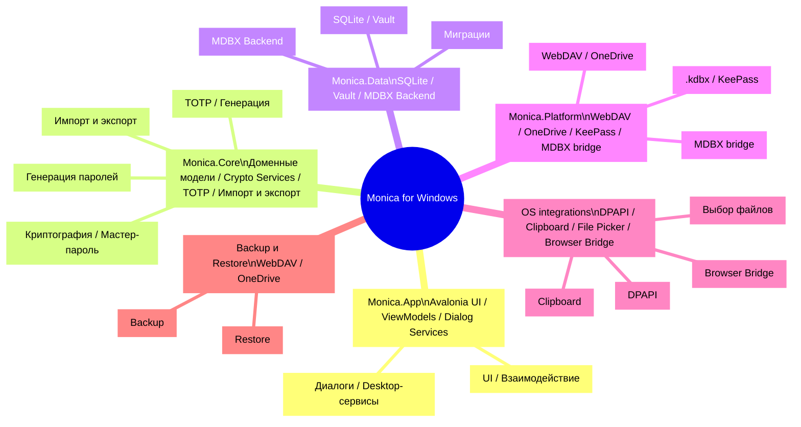

# Monica for Windows

> Monica by Avalonia: local-first кроссплатформенное хранилище паролей на Avalonia, .NET и MDBX.  
> Windows / macOS / Linux · Local Vault · MDBX-1 · KeePass · TOTP · WebDAV / OneDrive

::: navCard
```yaml
- name: Monica by Avalonia
  desc: Локальное хранилище паролей Avalonia + .NET + MDBX
  link: https://github.com/Monica-Pass/Monica-by-Avalonia
  img: https://github.githubassets.com/images/modules/logos_page/GitHub-Mark.png
  badge: Репозиторий
  badgeType: tip

- name: wwiinnddyy
  desc: Участник проекта
  link: https://github.com/wwiinnddyy
  img: https://avatars.githubusercontent.com/u/53892426
  badge: Автор
  badgeType: info

- name: JoyinJoester
  desc: Участник проекта
  link: https://github.com/JoyinJoester
  img: https://avatars.githubusercontent.com/u/87232423
  badge: Автор
  badgeType: info
```
:::

::: note Кратко
Monica for Windows — desktop-реализация хранилища паролей Monica, сфокусированная на local-first подходе, управлении паролями и совместимости MDBX vault. Документ оформлен в стиле README и содержит обзор функций, стек, архитектуру и сведения для разработки.
:::

Monica for Windows переносит local-first и security-first направление Monica на desktop-платформы. Приложение предоставляет управление паролями, TOTP, приватными заметками, банковскими картами и документами, а также поддерживает локальное шифрование, импорт/экспорт, резервное копирование и совместимость MDBX vault.

---

## Позиционирование проекта

Monica for Windows — local-first клиент хранилища паролей для desktop-пользователей. Он построен на кроссплатформенном desktop UI Avalonia, .NET 10 и локальном MDBX vault, чтобы дать современный и расширяемый опыт управления паролями на desktop.

Ключевые цели:

- Предоставить локальное зашифрованное хранилище паролей и управление TOTP
- Поддержать совместимость с KeePass `.kdbx` и данными Monica / MDBX
- Поддержать резервное копирование и восстановление через WebDAV и OneDrive
- Дать desktop-интеграции: выбор файлов, clipboard, tray, глобальные горячие клавиши

---

## Что доступно

- Локальное хранилище паролей: учетные записи, пароли, URL, пользовательские поля, вложения и категории
- Управление TOTP: хранение и генерация динамических кодов
- Приватные заметки: обычный текст и предпросмотр Markdown
- Карты и документы: единое управление банковскими картами, идентификационными данными и другой чувствительной информацией
- Генерация паролей: встроенная генерация случайных паролей и анализ стойкости
- Локальное шифрование: инициализация, разблокировка, изменение мастер-пароля и настройки безопасного восстановления
- Импорт/экспорт: Monica JSON, password CSV, TOTP CSV, Aegis JSON и другие форматы
- Синхронизация и backup: WebDAV / OneDrive backup и restore
- MDBX vault: создание, проверка и управление локальными базами Monica MDBX-1

---

## Технологический стек

| Слой | Технологии | Описание |
| --- | --- | --- |
| Desktop UI | Avalonia 12, FluentAvaloniaUI, FluentIcons.Avalonia | Кроссплатформенный desktop UI и Fluent-контролы |
| Framework | .NET 10, C# nullable, compiled bindings | Современный .NET desktop runtime и типобезопасные binding |
| MVVM | CommunityToolkit.Mvvm | ViewModel, команды и уведомления свойств |
| DI и logging | Microsoft.Extensions.DependencyInjection, Microsoft.Extensions.Logging, Serilog | Регистрация сервисов и абстракция логирования |
| Локальные данные | Microsoft.Data.Sqlite, SQLitePCLRaw, Dapper, Dapper.AOT | Легкий доступ к данным, миграции и AOT-friendly запросы |
| Криптография и безопасность | BouncyCastle, Argon2, ProtectedData, AES/SHA | Вывод мастер-пароля и защита локальных данных |
| Парольные возможности | PasswordGenerator, zxcvbn-core, Pwned Password checks | Генерация паролей, оценка стойкости и проверка риска |
| TOTP / QR | Otp.NET, QRCoder, ZXing.Net | Динамические коды и генерация/разбор QR |
| Импорт/экспорт | CsvHelper, SharpCompress, System.Text.Json | CSV, JSON, сжатые backup и миграция |
| KeePass | KPCLib | Совместимость `.kdbx` |
| Облако и синхронизация | WebDav.Client, Microsoft.Graph, Azure.Identity, MSAL, Polly | WebDAV, OneDrive, аутентификация и retry |
| MDBX | Rust MDBX workspace, UniFFI, `mdbx_ffi.dll` | Переиспользование ядра Monica MDBX vault |
| Тесты | xUnit, Microsoft.NET.Test.Sdk, coverlet | Тесты core-сервисов и platform-сервисов |

---

## Обзор архитектуры

::: tip Предпросмотр архитектуры
Архитектуру Monica for Windows можно представить как дерево мышления desktop-хранилища паролей, где:

- UI-слой отвечает за взаимодействие и отображение
- Core-слой отвечает за бизнес-логику и криптографию
- Data-слой отвечает за vault storage и персистентность
- Platform-слой отвечает за синхронизацию, platform-интеграции и адаптацию MDBX
:::

::: details Архитектурные заметки
- `Monica.App`: Avalonia UI, окна и desktop-сервисы
- `Monica.Core`: доменные модели, криптография, TOTP, импорт/экспорт, генерация паролей
- `Monica.Data`: локальная база, vault storage, миграции и MDBX backend repositories
- `Monica.Platform`: кроссплатформенный адаптерный слой с WebDAV, OneDrive, KeePass и MDBX bridge
- `MDBX Rust workspace`: vault core, криптография, хранение, FFI и CLI
- `OS integrations`: выбор файлов, clipboard, DPAPI, browser bridge
- `Remote backup`: каналы WebDAV/OneDrive backup и restore
:::

::: warning
В этой архитектуре <mark>MDBX не является обычной таблицей базы данных</mark>. Metadata commit, snapshot и conflict должны управляться через специальные API или FFI facade.
:::



### Каталоги кода

- `monica by avalonia/src/Monica.App`: вход Avalonia-приложения, главное окно, ViewModel и desktop UI-сервисы
- `monica by avalonia/src/Monica.Core`: core-модели, криптография, TOTP, генерация паролей, импорт/экспорт и безопасность
- `monica by avalonia/src/Monica.Data`: SQLite database, Dapper repositories, миграции, vault storage и MDBX backend repositories
- `monica by avalonia/src/Monica.Platform`: platform adapters, WebDAV, OneDrive, KeePass, Windows Secret Protector и native bridge MDBX UniFFI
- `monica by avalonia/tests/Monica.Tests`: тесты core-сервисов, repositories, MDBX integration и platform-сервисов

---

## Интеграция MDBX-1

Monica for Windows поддерживает MDBX-1 local-first vault. Это не обычная SQLite-таблица паролей, а локальный формат базы данных с историей версий, обработкой конфликтов, восстановлением snapshot и границами безопасности.

На стороне Avalonia сейчас есть два пути интеграции MDBX:

- `MdbxUniffiNativeBridge`: вызывает UniFFI bridge через `mdbx_ffi.dll` и работает с MDBX vault прямо в локальном процессе
- `MdbxCliVaultEngine`: fallback на MDBX CLI, если native bridge недоступен; в основном для разработки и проверки

> MDBX-клиенты должны поддерживать metadata commit, tombstone, snapshot, conflict и device head через storage / repo API библиотеки или явный FFI facade. Не изменяйте нижележащие файлы напрямую.

Подробнее см. документацию репозитория MDBX.

---

## Быстрый старт

### Требования

- .NET SDK 10.0+
- Desktop-среда Windows
- Rust toolchain, если нужен fallback через MDBX CLI

### Restore и build

```powershell
cd "e:\projects\MonicaDocs\docs\03.生态\03.Windows\monica by avalonia"
dotnet restore Monica.slnx
dotnet build Monica.slnx
```

### Запуск desktop-клиента

```powershell
dotnet run --project "src\Monica.App\Monica.App.csproj"
```

### Запуск тестов

```powershell
dotnet test Monica.slnx
```

### Пример publish

```powershell
dotnet publish "src\Monica.App\Monica.App.csproj" -c Release -r win-x64 --self-contained true
```

---

## Текущий статус

- Проект находится на ранней стадии (`0.1.0`) и в основном служит baseline для desktop-архитектуры и MDBX-интеграции.
- Тестовая база уже покрывает настройки приложения, core-сервисы, управление паролями, TOTP, MDBX storage и platform-сервисы.
- Для реальных чувствительных данных рекомендуется держать несколько резервных копий. Перед официальным релизом нужны дополнительные скриншоты и release notes.

---

## Связь с Monica / MDBX

- Monica: дает продуктовую идею, local-first направление и UX-ориентир для управления паролями
- MDBX: дает local-first формат vault и долгосрочно поддерживаемую структуру данных
- Monica for Windows: объединяет оба направления в desktop-реализации для Windows

---

## Благодарности

Monica for Windows ориентируется на следующие проекты и заимствует у них идеи:

- [Avalonia](https://avaloniaui.net/) - кроссплатформенный desktop UI
- [FluentAvalonia](https://github.com/amwx/FluentAvalonia) - Fluent-контролы
- [Bitwarden](https://bitwarden.com/) - ориентир экосистемы управления паролями
- [KeePass](https://keepass.info/) - локальное хранилище паролей и совместимость `.kdbx`
- [MDBX](https://github.com/Monica-Pass/Mdbx) - ориентир local-first vault format

---

## Лицензия

Проект распространяется как open source по [GNU General Public License v3.0](LICENSE).
