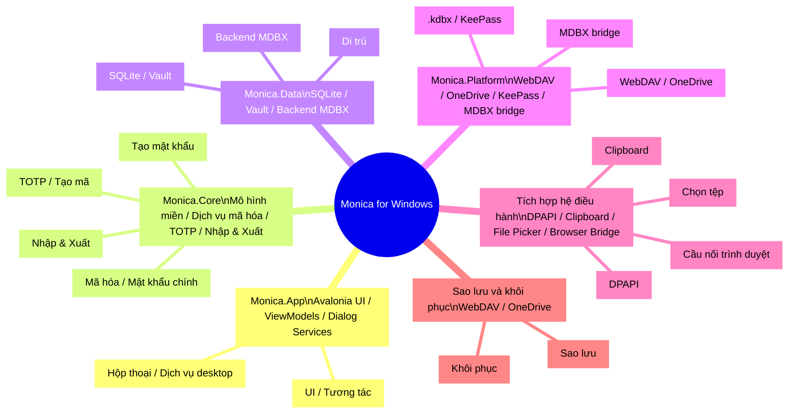

# Monica for Windows

> Monica by Avalonia: kho mật khẩu đa nền tảng ưu tiên cục bộ được xây dựng bằng Avalonia, .NET và MDBX.  
> Windows / macOS / Linux · Local Vault · MDBX-1 · KeePass · TOTP · WebDAV / OneDrive

::: navCard
```yaml
- name: Monica by Avalonia
  desc: Kho mật khẩu cục bộ Avalonia + .NET + MDBX
  link: https://github.com/Monica-Pass/Monica-by-Avalonia
  img: https://github.githubassets.com/images/modules/logos_page/GitHub-Mark.png
  badge: Kho mã
  badgeType: tip

- name: wwiinnddyy
  desc: Người đóng góp dự án
  link: https://github.com/wwiinnddyy
  img: https://avatars.githubusercontent.com/u/53892426
  badge: Tác giả
  badgeType: info

- name: JoyinJoester
  desc: Người đóng góp dự án
  link: https://github.com/JoyinJoester
  img: https://avatars.githubusercontent.com/u/87232423
  badge: Tác giả
  badgeType: info
```
:::

::: note Tóm tắt
Monica for Windows là bản triển khai desktop của kho mật khẩu Monica, tập trung vào ưu tiên cục bộ, quản lý mật khẩu và tương thích MDBX vault. Tài liệu này theo phong cách README, cung cấp giới thiệu tính năng, công nghệ, kiến trúc và ghi chú phát triển.
:::

Monica for Windows hướng tới việc đưa lộ trình ưu tiên cục bộ và ưu tiên bảo mật của Monica lên nền tảng desktop, cung cấp quản lý mật khẩu, TOTP, ghi chú riêng tư, thẻ ngân hàng và giấy tờ định danh, đồng thời hỗ trợ mã hóa cục bộ, nhập/xuất, sao lưu và tương thích MDBX vault.

---

## Định vị dự án

Monica for Windows là ứng dụng khách kho mật khẩu ưu tiên cục bộ dành cho người dùng desktop. Dựa trên UI desktop đa nền tảng Avalonia, kết hợp .NET 10 và MDBX local vault, dự án xây dựng trải nghiệm quản lý mật khẩu desktop hiện đại và có thể mở rộng.

Mục tiêu cốt lõi:

- Cung cấp kho mật khẩu mã hóa cục bộ và năng lực quản lý TOTP
- Hỗ trợ tương thích KeePass `.kdbx` và dữ liệu Monica / MDBX
- Hỗ trợ sao lưu và khôi phục qua WebDAV và OneDrive
- Cung cấp tích hợp desktop như chọn tệp, clipboard, khay hệ thống và phím tắt toàn cục

---

## Bạn nhận được gì

- Kho mật khẩu cục bộ: quản lý tài khoản, mật khẩu, URL, trường tùy chỉnh, tệp đính kèm và phân loại
- Quản lý TOTP: lưu và tạo mã xác minh động
- Ghi chú riêng tư: hỗ trợ văn bản thuần và xem trước Markdown
- Thẻ và giấy tờ: quản lý thống nhất thẻ ngân hàng, thông tin định danh và dữ liệu nhạy cảm khác
- Tạo mật khẩu: tích hợp tạo mật khẩu ngẫu nhiên và phân tích độ mạnh
- Mã hóa cục bộ: thiết lập, mở khóa, thay đổi mật khẩu chính và cấu hình khôi phục an toàn
- Nhập và xuất: hỗ trợ Monica JSON, password CSV, TOTP CSV, Aegis JSON và các định dạng khác
- Đồng bộ và sao lưu: sao lưu/khôi phục WebDAV / OneDrive
- MDBX vault: tạo, kiểm tra và quản lý cơ sở dữ liệu cục bộ Monica MDBX-1

---

## Công nghệ

| Lớp | Công nghệ | Ghi chú |
| --- | --- | --- |
| Desktop UI | Avalonia 12, FluentAvaloniaUI, FluentIcons.Avalonia | UI desktop đa nền tảng và điều khiển phong cách Fluent |
| Khung ứng dụng | .NET 10, C# nullable, compiled bindings | Runtime desktop .NET hiện đại và binding an toàn kiểu |
| MVVM | CommunityToolkit.Mvvm | ViewModel, command và thông báo thuộc tính |
| Dependency injection và logging | Microsoft.Extensions.DependencyInjection, Microsoft.Extensions.Logging, Serilog | Đăng ký dịch vụ và trừu tượng hóa logging |
| Dữ liệu cục bộ | Microsoft.Data.Sqlite, SQLitePCLRaw, Dapper, Dapper.AOT | Truy cập dữ liệu nhẹ, di trú và truy vấn thân thiện AOT |
| Mã hóa và bảo mật | BouncyCastle, Argon2, ProtectedData, AES/SHA | Dẫn xuất mật khẩu chính và bảo vệ dữ liệu cục bộ |
| Năng lực mật khẩu | PasswordGenerator, zxcvbn-core, Pwned Password checks | Tạo mật khẩu, đánh giá độ mạnh và phát hiện rủi ro |
| TOTP / QR | Otp.NET, QRCoder, ZXing.Net | Mã động và tạo/phân tích mã QR |
| Nhập/xuất | CsvHelper, SharpCompress, System.Text.Json | CSV, JSON, sao lưu nén và di trú |
| Hệ sinh thái KeePass | KPCLib | Tương thích `.kdbx` |
| Đám mây và đồng bộ | WebDav.Client, Microsoft.Graph, Azure.Identity, MSAL, Polly | WebDAV, OneDrive, xác thực và retry |
| Tích hợp MDBX | Rust MDBX workspace, UniFFI, `mdbx_ffi.dll` | Tái sử dụng năng lực lõi Monica MDBX vault |
| Kiểm thử | xUnit, Microsoft.NET.Test.Sdk, coverlet | Kiểm thử dịch vụ lõi và dịch vụ nền tảng |

---

## Tổng quan kiến trúc

::: tip Xem trước kiến trúc
Kiến trúc Monica for Windows có thể hiểu như một cây tư duy của kho mật khẩu desktop, với trọng tâm:

- Lớp UI phụ trách tương tác và hiển thị
- Lớp Core phụ trách nghiệp vụ và logic mã hóa
- Lớp Data phụ trách lưu trữ vault và bền vững dữ liệu
- Lớp Platform phụ trách đồng bộ, tích hợp nền tảng và adapter MDBX
:::

::: details Ghi chú kiến trúc
- `Monica.App`: giao diện Avalonia, cửa sổ và dịch vụ desktop
- `Monica.Core`: mô hình nghiệp vụ, mã hóa, TOTP, nhập/xuất, tạo mật khẩu
- `Monica.Data`: cơ sở dữ liệu cục bộ, lưu trữ vault, di trú và repository backend MDBX
- `Monica.Platform`: lớp adapter đa nền tảng gồm WebDAV, OneDrive, KeePass và MDBX bridge
- `MDBX Rust workspace`: lõi vault, mã hóa, lưu trữ, FFI và CLI
- `OS integrations`: chọn tệp, clipboard, DPAPI, cầu nối trình duyệt
- `Remote backup`: kênh sao lưu/khôi phục WebDAV/OneDrive
:::

::: warning
Trong kiến trúc này, <mark>MDBX không phải là bảng cơ sở dữ liệu thông thường</mark>. Metadata commit, snapshot và conflict phải được quản lý qua API chuyên dụng hoặc FFI facade.
:::



### Thư mục mã nguồn

- `monica by avalonia/src/Monica.App`: entry point Avalonia, cửa sổ chính, ViewModel và dịch vụ UI desktop
- `monica by avalonia/src/Monica.Core`: mô hình lõi, mã hóa, TOTP, tạo mật khẩu, nhập/xuất và năng lực bảo mật
- `monica by avalonia/src/Monica.Data`: cơ sở dữ liệu SQLite, repository Dapper, di trú, lưu trữ vault và repository backend MDBX
- `monica by avalonia/src/Monica.Platform`: adapter nền tảng, WebDAV, OneDrive, KeePass, Windows Secret Protector và cầu nối native MDBX UniFFI
- `monica by avalonia/tests/Monica.Tests`: kiểm thử dịch vụ lõi, repository, tích hợp MDBX và dịch vụ nền tảng

---

## Tích hợp MDBX-1

Monica for Windows hỗ trợ MDBX-1 local-first vault. Đây không phải là bảng mật khẩu SQLite thông thường, mà là định dạng cơ sở dữ liệu cục bộ có lịch sử phiên bản, xử lý xung đột, khôi phục snapshot và ranh giới bảo mật.

Phía Avalonia hiện có hai đường tích hợp MDBX:

- `MdbxUniffiNativeBridge`: gọi UniFFI bridge qua `mdbx_ffi.dll` để thao tác trực tiếp MDBX vault trong tiến trình cục bộ
- `MdbxCliVaultEngine`: fallback sang MDBX CLI khi native bridge không khả dụng, chủ yếu dùng cho phát triển và xác minh

> Ứng dụng khách MDBX phải duy trì metadata commit, tombstone, snapshot, conflict và device head thông qua storage / repo API do thư viện cung cấp hoặc FFI facade rõ ràng. Tránh chỉnh sửa trực tiếp tệp tầng dưới.

Vui lòng tham khảo tài liệu kho MDBX để biết thêm quy chuẩn.

---

## Bắt đầu nhanh

### Yêu cầu môi trường

- .NET SDK 10.0+
- Môi trường desktop Windows
- Nếu bật fallback MDBX CLI, cần cài Rust toolchain

### Khôi phục và build

```powershell
cd "e:\projects\MonicaDocs\docs\03.生态\03.Windows\monica by avalonia"
dotnet restore Monica.slnx
dotnet build Monica.slnx
```

### Chạy ứng dụng desktop

```powershell
dotnet run --project "src\Monica.App\Monica.App.csproj"
```

### Chạy kiểm thử

```powershell
dotnet test Monica.slnx
```

### Ví dụ phát hành

```powershell
dotnet publish "src\Monica.App\Monica.App.csproj" -c Release -r win-x64 --self-contained true
```

---

## Trạng thái hiện tại

- Dự án ở giai đoạn phát triển sớm (`0.1.0`), chủ yếu làm baseline kiến trúc desktop và tích hợp MDBX.
- Nền tảng kiểm thử đã bao phủ cài đặt app, dịch vụ lõi, quản lý mật khẩu, TOTP, lưu trữ MDBX và dịch vụ nền tảng.
- Với dữ liệu nhạy cảm thật, vẫn nên giữ nhiều bản sao lưu. Trước khi phát hành chính thức cần bổ sung thêm ảnh chụp và ghi chú phát hành.

---

## Quan hệ với Monica / MDBX

- Monica: cung cấp理念 sản phẩm, lộ trình ưu tiên cục bộ và tham khảo trải nghiệm quản lý mật khẩu
- MDBX: cung cấp định dạng vault ưu tiên cục bộ và cấu trúc dữ liệu có thể bảo trì lâu dài
- Monica for Windows: triển khai desktop kết hợp năng lực của cả hai trên Windows

---

## Lời cảm ơn

Monica for Windows tham khảo và lấy cảm hứng từ các dự án sau:

- [Avalonia](https://avaloniaui.net/) - UI desktop đa nền tảng
- [FluentAvalonia](https://github.com/amwx/FluentAvalonia) - điều khiển phong cách Fluent
- [Bitwarden](https://bitwarden.com/) - tham khảo hệ sinh thái quản lý mật khẩu
- [KeePass](https://keepass.info/) - tham khảo kho mật khẩu cục bộ và tương thích `.kdbx`
- [MDBX](https://github.com/Monica-Pass/Mdbx) - tham khảo định dạng vault ưu tiên cục bộ

---

## Giấy phép

Dự án được phát hành mã nguồn mở theo [GNU General Public License v3.0](LICENSE).
