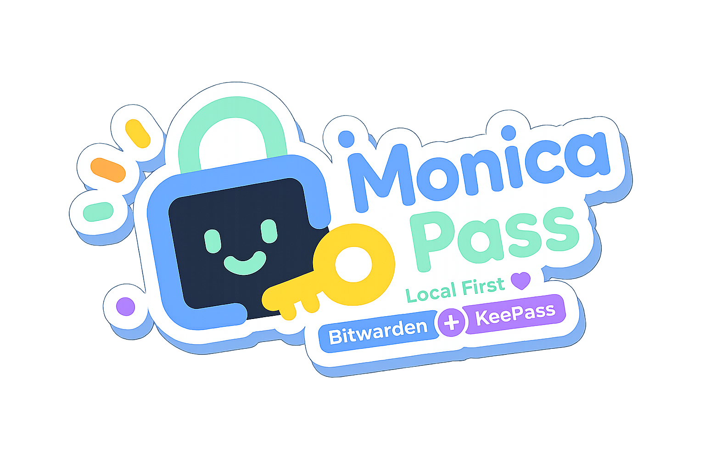

<h1 align="center">Monica ～猫猫的本地秘密保险箱喵</h1>

[中文](README.md) | [English](README_EN.md) | [日本語](README_JA.md) | [Tiếng Việt](README_VI.md) | [Русский](README_RU.md) | **黑羽川**

<strong>把 Bitwarden 和 KeePass 都收进肉球里的本地优先密码库喵</strong>

Android / Browser · Local Vault · TOTP · WebDAV Backup

	猫猫的朋友：
	<a href="https://linux.do" title="Linux.do">
		
		Linux.do
	</a>

Monica 是人家认真打理的小窝喵。

它会把 **Bitwarden** 和 **KeePass** 的好东西都轻轻叼回来，放进本地的秘密保险箱里喵。密码、2FA、私密笔记、敏感附件，都可以在 Android 和浏览器之间乖乖待好喵。

人家的想法很简单喵：重要的数据最好睡在自己的窝里，不要随便交给陌生的云朵保管喵。

### 先把猫耳朵竖起来听一件重要的事喵

Monica 的开发者只是一个会犯懒的大笨蛋铲屎官喵。

他有时候会偷懒，有时候会说「反正 AI 写得比我好」这种很欠揉脑袋的话喵。所以你要答应人家：一定要好好备份喵。数据隐私是无价的小鱼干，不能全都压在一个篮子里喵。

官网入口在这里喵: https://joyinjoester.github.io/Monica/

> Monica for Windows 已经钻进纸箱里归档了喵。想考古的话看这里喵: [Monica-for-Windows](https://github.com/JoyinJoester/Monica-for-Windows)
>
> Monica for Browser 也已经趴进纸箱归档了喵。新的 Monica Extension 正在重新搭窝开发中，敬请期待喵。
>
> 现在项目主要由一只猫维护喵，爪子、时间和精力都有限喵。所以 Monica for Wear 只能暂时趴着休息喵。当前猫力主要集中在 Monica for Android 的功能完善、体验优化和稳定性维护上喵。谢谢你愿意摸摸头理解喵。

---

## 给刚进窝的小猫看喵

### Monica 适合谁喵

- 如果你喜欢本地优先的密码管理，不想把账号数据托管到第三方云，Monica 会很合适喵。
- 如果你既使用 Bitwarden，也维护 KeePass（`.kdbx`）数据，Monica 可以帮你把两边的东西放进同一个窝里喵。
- 如果你日常使用 Android，又想在浏览器里完成自动填充，Monica 也可以陪你一起工作喵。

### 你可以得到什么喵

- **本地加密保险箱**：登录信息、银行卡、身份信息、私密笔记和附件都会被好好收起来喵。
- **双生态聚合**：Android 端包含 Bitwarden API/同步能力，也包含 KeePass（`.kdbx`）读写能力喵。
- **可选同步与备份**：可以通过自己的 WebDAV 基础设施在设备之间搬运数据喵。
- **内置 TOTP**：密码和二次验证码可以在同一个应用里管理喵。

### 怎么把 Monica 带回家喵

Android 小猫这样做喵：

1. 去 [Releases](https://github.com/JoyinJoester/Monica/releases) 下载最新 APK 喵。
2. 在 Android 8.0+ 设备上安装喵。
3. 初始化主密码喵，然后把它好好记住喵。

浏览器插件小猫这样做喵：

1. 在 `Monica for Browser` 目录构建插件喵。
2. 打开 `chrome://extensions/` 并启用开发者模式喵。
3. 选择「加载已解压的扩展程序」，导入 `dist` 目录喵。

### 现在还会有一点点遗憾喵

- 因为系统兼容性原因，Monica for Android 目前在部分小米 HyperOS 设备上可能无法创建通行密钥（Passkey）喵。这个锅人家会记在小本本上喵。

---

## Android 版会做什么喵

### 核心本领喵

- **本地 Vault**：所有核心凭据都在本地加密存储喵。
- **聚合导入**：支持 KeePass 数据迁移，也支持 Bitwarden 兼容接入喵。
- **智能检索**：可以按标题、域名、标签快速找到凭据喵。
- **生物识别解锁**：用系统级生物识别能力提升安全和可用性喵。
- **TOTP 管理**：统一存储并生成动态验证码喵。

### 给懂技术的猫看的实现说明喵

- **UI 层**：Jetpack Compose + Material 3 + Navigation Compose 喵。
- **数据层**：Room（`PasswordDatabase`）+ DAO + Repository 喵。
- **并发模型**：Kotlin Coroutines + Flow 喵。
- **依赖注入**：Koin，应用启动于 `MonicaApplication` 喵。
- **安全能力**：Android Keystore、EncryptedSharedPreferences、BiometricPrompt 喵。
- **同步任务**：WorkManager（`AutoBackupWorker`）负责自动 WebDAV 备份喵。
- **协议与集成**：Retrofit + OkHttp、kotpass、sardine-android 喵。

### 安全模型喵

- **加密算法**：AES-256-GCM，认证加密喵。
- **密钥派生**：PBKDF2-HMAC-SHA256，使用高迭代参数喵。
- **本地保护**：主密码哈希与安全配置由本地安全组件管理喵。
- **网络边界**：网络权限主要用于 Bitwarden 联动、WebDAV 备份和同步等在线能力喵。

---

## 给人家投喂小鱼干喵

如果 Monica 对你有帮助，欢迎支持持续开发与安全投入喵。

 
微信 / 支付宝扫码支持喵

你的小鱼干会优先用于喵：

- 安全审计与加密方案强化喵。
- Android 体验优化与稳定性改进喵。
- 跨端功能统一与文档维护喵。

---

## 给想一起搭窝的开发猫看喵

### 项目分层喵

- `takagi/ru/monica/ui`：Compose 页面与组件喵。
- `takagi/ru/monica/data`：Room 实体、DAO、数据库迁移喵。
- `takagi/ru/monica/repository`：数据访问封装喵。
- `takagi/ru/monica/security`：加密、密钥与鉴权相关实现喵。
- `takagi/ru/monica/bitwarden`：API、加密、映射、同步与视图模型喵。
- `takagi/ru/monica/autofill`：自动填充服务与流程喵。
- `takagi/ru/monica/passkey`：Android 14+ Credential Provider 相关实现喵。
- `takagi/ru/monica/workers`：后台任务，比如自动 WebDAV 备份喵。

### 当前使用的成熟组件喵

- Android UI：Jetpack Compose, Material 3, Navigation Compose 喵。
- 数据与状态：Room, DataStore Preferences, ViewModel 喵。
- 安全：Android Keystore, EncryptedSharedPreferences, BiometricPrompt 喵。
- 网络与协议：Retrofit, OkHttp, Kotlinx Serialization 喵。
- 同步与生态：sardine-android（WebDAV）, kotpass（KeePass）, Bitwarden API 对接喵。
- 异步与任务：Coroutines, Flow, WorkManager 喵。
- 其他能力：CameraX + ML Kit（二维码扫描）, Credentials API（Passkey）喵。

### 构建与贡献喵

- Android Studio：最新稳定版喵。
- JDK：17+ 喵。
- Android 配置：`compileSdk 35`，`targetSdk 34`，`minSdk 26`，详见 `Monica for Android/app/build.gradle` 喵。
- Android 构建基线：AGP `8.6.0`，Kotlin `2.0.21`，Compose BOM `2026.03.00` 喵。
- 版本信息以 `Monica for Android/gradle/libs.versions.toml` 与 `Monica for Android/app/build.gradle` 为准喵。
- 浏览器端技术栈：React + TypeScript + Vite，详见 `Monica for Browser/package.json` 喵。
- 欢迎通过 Issue / PR 参与功能和安全改进喵。

---

## 摸摸头致谢喵

Monica 的设计、兼容性适配与部分功能方向，受到了这些优秀开源项目和软件的启发喵：

- [Keyguard](https://github.com/AChep/keyguard-app) - Android 端密码管理器的交互设计与体验参考喵。
- [Bitwarden](https://bitwarden.com/) - 开源密码管理生态、Vault 模型与同步能力的重要参考喵。
- [KeePass](https://keepass.info/) - 本地密码库理念与 `.kdbx` 生态兼容的重要基础喵。
- [Stratum Auth](https://github.com/stratumauth/app) - 身份验证器体验、图标资源与相关兼容支持参考喵。

---

## Star History 喵

---

## 许可证喵

Copyright (c) 2025 JoyinJoester

Monica 基于 [GNU General Public License v3.0](LICENSE) 开源发布喵。

## 第三方图标标注喵

- 本项目本地打包了来自 [Stratum Auth app](https://github.com/stratumauth/app) 的图标资源喵（版本 [v1.4.0](https://github.com/stratumauth/app/releases/tag/v1.4.0)，目录 [icons](https://github.com/stratumauth/app/tree/v1.4.0/icons) / [extraicons](https://github.com/stratumauth/app/tree/v1.4.0/extraicons)，GPL-3.0）。
- 品牌名称与 Logo 的商标权归各自权利人所有喵。
